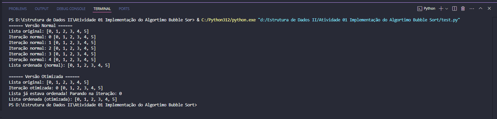

# 🌀 Implementação do Algoritmo Bubble Sort

## 📚 Descrição
Implementação do **Bubble Sort** nas versões:
- Normal
- Otimizada (encerra se a lista já estiver ordenada)

Atividade prática de **Estrutura de Dados II**.

---

## ⚙️ Como executar

```bash
python test.py
```

---

## 🖼️ Exemplo de execução:



---

## 🔍 Observação
A versão otimizada detecta se a lista já está ordenada e evita iterações desnecessárias.

Em listas bagunçadas, a otimização nem sempre faz muita diferença!

---

## ✅ Conclusão
Código testado com listas pequenas, com foco em aprendizado da lógica de ordenação passo a passo.
